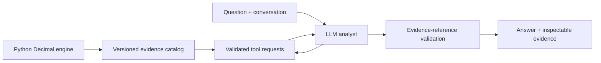

# Ledger — Financial Analyst Agent

An LLM analyst that chooses financial tools, investigates changes in operating performance, and links its findings to Python-calculated evidence.

**Status:** working prototype with real OpenAI tool-use runs, deterministic financial tools, and saved evaluation artifacts. Both provider adapters have mocked protocol tests; Anthropic has not been tested against a live endpoint. The built-in calculation preview is explicitly labeled and is not presented as an LLM response. See `docs/evaluation-report.md` for measured results and limitations.

Ask questions such as:

- Why did operating profit change from Q1 to Q2?
- Which account contributed most, and which corresponding months explain the change?
- Can we compare these quarters when one month is missing?
- Does an increase in COGS establish that supplier prices increased?

The model selects tools and periods, chooses a follow-up investigation, and writes an evidence-linked answer. Financial calculations use Python `Decimal`; the LLM does not run arbitrary code.

## Run locally

Requirements: Node.js 22.13+ (24 recommended), npm, Python 3.10+.

```sh
npm ci
npm run data:build
cp -n .env.example .env.local
# Edit .env.local to configure one provider; never commit this file.
npm run dev
```

Local development uses the Node server; the production build targets a Cloudflare Worker. Open the Local URL printed by the server. On this Mac, `./scripts/dev.sh` also locates Codex's bundled Node if the shell's Node is too old.

To explore without a key, choose a company and click **Explore a calculation preview**. The dashboard, source data, profit bridge, and evidence inspection work without inference.

For real model calls, set these **server-only** values in `.env.local`, then restart:

```dotenv
LLM_PROVIDER=openai
OPENAI_API_KEY=your-local-key
ENABLE_LIVE_LLM=true
# Optional account-specific model override:
OPENAI_MODEL=gpt-5.6-luna
```

Or use `LLM_PROVIDER=anthropic`, `ANTHROPIC_API_KEY`, and optionally `ANTHROPIC_MODEL=claude-sonnet-5`. Both providers are selectable in the interface; each needs its own key. `LLM_MODEL` is a common fallback override. Model availability depends on the account. No credential is accepted by the browser or included in exported traces.

Local `.env.local` values are not deployed. Hosted credentials must be configured separately as server secrets. Keep a live deployment private until authentication and durable spend/rate controls are added.

## How it works



**Deployment tradeoff:** Python calculates the complete supported fact catalog ahead of time. The web server retrieves those Python-produced facts for the model's chosen tools. It does not recalculate financial values in JavaScript or run a Python interpreter inside the hosted Worker. This keeps the prototype portable and reproducible, with a deliberately finite universe of six companies and January–June 2025 periods. Adding data or formulas requires regenerating the catalog.

The tools are `inspect_dataset`, `calculate_metrics`, `compare_periods`, and `explain_profit_change`. The model finishes through `submit_analysis`. A direct metric question and a multi-step investigation can use different tool paths. Original rows, formulas, dataset hashes, and tool results accompany the answer.

OpenAI uses a stateless Responses continuation with complete prior output, including encrypted reasoning items. Anthropic uses Messages with grouped tool results immediately following each assistant tool-use message. Neither adapter exposes private model reasoning in the interface. The displayed activity is the actual tool-call log.

## Data and calculation rules

Six independently authored synthetic companies cover healthy growth, shrinking margins, and missing records. `company-01` through `company-03` are development data; `company-04` through `company-06` are reserved check data. Dataset names are neutral; scenario labels and evaluation oracles are not sent to the model.

- Gross profit = revenue − COGS.
- Operating profit = revenue − COGS − operating expenses.
- Period margins use aggregate profits divided by aggregate revenue.
- Margin changes use percentage points; percentage growth requires a positive baseline.
- Incomplete periods return unavailable values, not sums mislabeled as complete quarters.
- The profit bridge reconciles revenue change minus cost changes. It does not prove customer, supplier, hiring, or pricing causes.

Money is validated to cents and calculated with Decimal. Ratios are serialized to six decimal places and formatted separately. A data hash ties each exported answer to the inputs used. Source files and generator parameters are committed; the generator has no random or model-created values.

## Checks and evaluation

```sh
npm test
npm run typecheck
npm run lint
npm run build
```

Python tests use hand-worked independent goldens and edge cases. Adapter tests use **mocked** provider responses to check continuation, evidence references, truncation, errors, and bounded loops; they do not establish live model quality.

Twelve reserved check tasks are in `evals/cases.json`. They include numeric questions, accounting bridges, adaptive monthly investigations, unsupported business causes, and incomplete-period comparisons. A small held-out set from shared generator families is not evidence of production reliability.

After configuring a real provider and starting the server:

```sh
python3 evals/run.py --provider openai --run-live --limit 2
# Then run all twelve, preserving the pilot results:
python3 evals/run.py --provider openai --run-live
```

Use `--case-id company-05-1 --no-public-summary` for an isolated rerun; the original attempt remains saved.

The explicit `--run-live` flag authorizes provider calls. The runner saves **every attempted task**, errors, full traces, model ID, dataset hash, token counts, latency, and a blank human-review template under `results/<timestamp>/`. It updates the Evaluation tab's status. Pilot cases inspected during tuning must no longer be described as untouched holdout.

Automatic evidence coverage checks only establish whether expected facts were collected. **Valid references do not prove the text is true.** Review the whole response—including its summary—against the case rubric for numeric accuracy, period/unit selection, supported claims, uncertainty, and task completion. Never report unreviewed cases as passes. The Evaluation tab reports attempted tasks separately from reviewed accuracy. Any automated semantic review is labeled as Codex-assisted; human review remains a separate step.

## Scope and limitations

- The universe of data, periods, and financial tools is intentionally bounded.
- No arbitrary uploads, forecasts, live company feeds, personal financial data, or trades.
- Maximum eight executed calculation tools, ten model rounds, 90-second investigation deadline, and bounded per-call output. Provider charges can accrue before a request fails.
- The token ceiling is checked after each response; it is not a provider-enforced dollar cap. Configure provider spending limits separately.
- The six-per-minute in-memory request limiter is per Worker instance. It is a prototype guard, not a globally durable quota.
- Conversation state is local to the page and clears when changing companies; exported JSON is the durable trace.
- Semantic claim support needs human review. The system does not claim that all generated statements are automatically verified.
- Browser UI testing and WebMCP runtime verification have not been performed. Server rendering, HTTP routes, type checking, and automated checks are recorded in `docs/validation.md`.

## Project map

```text
app/                         Web page and server endpoints
components/ledger.tsx        Conversational workspace and evidence UI
python/financial_analyst/    Decimal calculations and data/catalog generation
lib/agent.ts                 Provider adapters and bounded agent loop
lib/tools.ts                 Tool schemas, dispatch, reference validation
lib/generated/               Python-produced evidence and UI summaries
data/synthetic/              Auditable source records
evals/                       Independent tasks, oracles, live runner
results/                     Saved model runs
tests/                       Arithmetic and mocked provider tests
docs/                        Architecture, validation, portfolio case study
```

Official implementation references: [OpenAI function calling](https://developers.openai.com/api/docs/guides/function-calling), [OpenAI model catalog](https://developers.openai.com/api/docs/models), [Anthropic tool handling](https://platform.claude.com/docs/en/agents-and-tools/tool-use/handle-tool-calls), [Anthropic model catalog](https://platform.claude.com/docs/en/models/overview).
