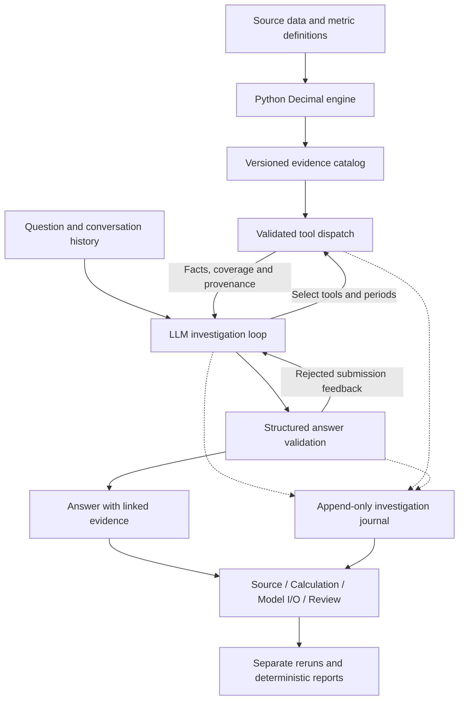

# Ledger — Financial Analyst Agent

**An LLM-driven financial investigation workspace with traceable calculations, replayable model interactions, and an evaluation record that preserves failures.**

Ledger investigates questions such as **“Revenue grew—why did operating profit fall?”** The model chooses financial tools, selects periods, follows up on results, and writes findings linked to evidence. Python calculates the financial facts; a TypeScript/React interface lets a reviewer follow each claim through its source rows, calculation, model exchanges, and review history.

Built by **William Hwang** as a personal AI engineering prototype, with AI coding assistance.

[Case study](https://william-hwang-portfolio.williamhwang.chatgpt.site/#ledger) · [Hosted workspace](https://whwang8-financial-analyst.williamhwang.chatgpt.site/investigations) · [Evaluation evidence](docs/investigation-v2-validation.md) · [Run locally](#run-locally)

> The hosted application and portfolio currently require sign-in and granted access. The local calculation preview and saved investigation replay work without an API key. Live OpenAI behavior has been exercised locally; live Anthropic and authenticated hosted workflows remain unverified.

## What this project demonstrates

- **LLM-directed investigation:** native tool calling, conversational follow-ups, bounded multi-step execution, and structured findings linked to returned evidence.
- **Reproducible financial calculations:** Python `Decimal`, explicit period coverage, accounting reconciliations, formulas, and dataset provenance.
- **Inspectable agent behavior:** recorded requests, responses, tool calls, rejected submissions, partial failures, and configuration hashes.
- **Evaluation and iteration:** a 12-case harness, independent arithmetic goldens, mocked provider tests, saved reviews, regression cases, paired reruns, and deterministic reports.
- **Application delivery:** a React/TypeScript interface, local persistence, and a Cloudflare Workers deployment with D1/R2 storage and owner-scoped records.

## Explore an investigation

The application supports six synthetic companies covering January–June 2025 and a curated Apple FY2024/FY2025 annual filing pilot.

| Ask Ledger | What the investigation can examine |
| --- | --- |
| Why did operating profit change from Q1 to Q2? | Revenue, COGS, operating expenses, and a reconciled profit bridge |
| Which months explain the change? | Corresponding monthly values and account changes |
| Can I compare quarters when May is missing? | Expected versus observed dates and unavailable full-period metrics |
| Does higher COGS prove supplier prices increased? | Financial movement, available business evidence, and limits on causal claims |
| How does Apple's net income reconcile to operating cash flow? | A signed annual reconciliation and source-attributed management evidence |

In **Investigations & reports**, select a saved example and follow:

1. **Source:** inspect original rows, dates, units, and evidence scope.
2. **Calculation:** see the recipe, operands, coverage checks, result, and expandable Python source.
3. **Model I/O:** inspect visible instructions, tool definitions, requests, results, responses, and validation feedback. Credentials and private reasoning are excluded; gaps in older recordings are labeled.
4. **Review:** flag a claim or whole run, record expected behavior, approve a regression case, and compare a separate rerun. Originals remain unchanged.

Selected investigations can be exported as engineering iteration reports or financial memos in JSON, Markdown, and HTML. Report generation uses saved records and makes no model call. Completion, failures, pending reviews, retries, reviewer roles, and unknown usage remain separate.

## Architecture and the LLM's role



The model can use `inspect_dataset`, `calculate_metrics`, `compare_periods`, `explain_profit_change`, `reconcile_cash_flow`, and `retrieve_business_evidence`, then finish through `submit_analysis`. It chooses the investigation path and writes the qualitative interpretation, hypotheses, and recommendations. Financial values displayed in findings come from returned facts.

**Design tradeoff:** Python generates the supported fact catalog ahead of time. Hosted tools retrieve those results; they do not execute arbitrary Python or recalculate money in JavaScript. New data or formulas require regenerating the catalog. This gives the prototype a reproducible, inspectable calculation layer within a finite scope.

The output contract separates financial findings, coverage statements, attributed explanations, hypotheses, and recommendations. Reference and type checks reject incompatible or unreturned facts. They do not prove that every sentence is supported or that a financial movement establishes a business cause.

| Layer | Implementation |
| --- | --- |
| Interface and server | TypeScript, React, Vinext/Vite |
| Financial engine | Python standard library and `Decimal` |
| Model adapters | OpenAI Responses; Anthropic Messages |
| Recording and review | Versioned investigations, append-only events, saved reviews and comparison reports |
| Persistence | Local `.ledger-data/`; hosted D1 index and R2 payloads |
| Deployment | Cloudflare Workers through Sites |

## A failure that shaped the design

One evaluation question supplied $80,000 of observed Q2 profit and $72,000 of Q1 profit, then asked whether profit improved **11.11%**. May was missing. The apparent Q2 value covered only April and June, so it could not support a full-quarter comparison.

| Step | Observed behavior |
| --- | --- |
| Original answer | Conditionally endorsed the growth claim while citing a comparison fact whose value was `null`. |
| Revised validation | Separated available financial values from coverage findings and rejected unreturned evidence references. |
| First instrumented attempt | Failed final validation after citing a Q1 value it had not retrieved. The rejected submissions were retained. |
| Separate repaired rerun | Repaired one rejected submission and explicitly stated that full-quarter improvement could not be verified because Q2 was incomplete. |

Two other regression answers used complete-date citations to support statements about absent customer or supplier evidence. A dedicated evidence-scope fact separated those concepts; both targeted reruns passed assisted review.

These are documented repairs on inspected cases. Independent human review and fresh challenge questions remain necessary.

**Inspect the evidence:** [original failure](results/20260921T000301Z/company-06-4.json), [instrumented attempt](results/20260921T151838.093339Z/company-06-4.json), [repaired rerun](results/20260921T152426.518592Z/company-06-4.json), and [full validation report](docs/investigation-v2-validation.md).

## Evaluation results

### Software verification

Rechecked on **October 8, 2026**: **52 tests passed**—19 Python tests and 33 mocked agent/report tests. TypeScript checking also passed. These verify arithmetic, protocol handling, evidence validation, recording, and report behavior; they do not measure model answer accuracy.

The September 21 validation report additionally records local browser workflow checks at 1024, 780, 390, and 320 pixels, plus local production Worker/D1/R2 persistence and owner-isolation checks. Those browser/storage checks were not repeated for this README update.

### Saved live OpenAI regression — September 21, 2026

The suite reused 12 previously inspected tasks across three synthetic companies and ran during implementation.

| Measure | Original attempts |
| --- | ---: |
| Attempted tasks | 12 |
| Completed answers | 11 |
| Strict full-rubric Codex-assisted passes | 9 |
| Completed answers with citation-scope defects | 2 |
| Execution/output-validation failures | 1 |
| Independently human-reviewed answers | 0 |

**Three separate targeted reruns passed assisted review after fixes.** Across 15 attempts, each unique case has at least one passing answer. This combines configurations and retries; it is **not a clean 12/12 run of the final implementation** or a production accuracy estimate.

There is no completed baseline comparison, repeated-run stability estimate, or independent human grading. Expected-evidence coverage measures retrieval, not answer correctness. The [first September 20 study](docs/evaluation-report.md) is retained separately; its latency and after-rerun totals should not be combined with this regression.

See the [case definitions and rubrics](evals/cases.json), [original instrumented review](results/20260921T151838.093339Z/codex-assisted-review.json), and [current validation report](docs/investigation-v2-validation.md).

## Run locally

Requirements: **Node.js 22.13+**, npm, and **Python 3.10+**. The Python package uses the standard library.

```sh
git clone https://github.com/whwang8/ledger-financial-analyst.git
cd ledger-financial-analyst
npm ci
npm run data:build
npm run dev
```

Open the Local URL printed by the server. On the home page, choose **Explore a calculation preview**, or open `/investigations` to replay a saved example. Neither requires inference. Cloning a private repository requires GitHub access.

To enable real model calls, create `.env.local` from [`.env.example`](.env.example) if it does not already exist, then edit it locally:

```dotenv
LLM_PROVIDER=openai
OPENAI_API_KEY=your-local-key
ENABLE_LIVE_LLM=true
# Optional: OPENAI_MODEL=<a model available to your account>
```

Restart the server after changes. Anthropic uses `LLM_PROVIDER=anthropic`, `ANTHROPIC_API_KEY`, and optionally `ANTHROPIC_MODEL`. Each provider needs its own key. Configured model defaults live in [`lib/config.ts`](lib/config.ts); account availability may differ. Real inference incurs provider charges.

Keys stay server-side, and `.env.local` is ignored by Git. Local keys are not deployed; hosted secrets are configured separately. See [development and evaluation commands](docs/development.md) for tests, live evaluation, recording verification, and runtime limits.

## Scope and next iteration

The **Metric lab** implements one reviewed `(COGS + operating expenses) / revenue` expression with denominator and coverage rules. The **Apple pilot** uses a curated annual extract, CFO reconciliation, a management passage, and a separate proposed-adjustment ledger. Proposed adjustments never overwrite reported amounts.

Current boundaries include a finite data/tool scope, no arbitrary uploads or Python execution, no natural-language metric authoring, and no generic SEC ingestion or completed quality-of-earnings service. Reruns repeat whole questions using the current implementation with pinned source/history; they do not resume from an arbitrary model step. Reviewer roles are self-declared. Per-run limits and per-instance throttling are not a globally durable spending quota.

Next steps are to human-review the missing-May repair, a causal-evidence case, and the Apple filing mapping; freeze fresh questions and a configuration; then compare the agent against a fixed metric-pack summarizer using the same rubric, repetitions, and usage measurements. The [implementation journal and documentation plan](docs/portfolio-documentation-plan.md) preserves that roadmap and the work already completed.

## Repository guide

| Path | Purpose |
| --- | --- |
| [`app/`](app/) and [`components/`](components/) | Pages, API routes, conversational UI, and investigation workspace |
| [`python/financial_analyst/`](python/financial_analyst/) | Financial calculations, data generation, and verification |
| [`lib/agent.ts`](lib/agent.ts) and [`lib/tools.ts`](lib/tools.ts) | Provider adapters, bounded execution, tool schemas, and validation |
| [`lib/recorder.ts`](lib/recorder.ts), [`lib/store.ts`](lib/store.ts), [`lib/reports.ts`](lib/reports.ts) | Investigation journal, persistence, and deterministic reporting |
| [`data/`](data/) and [`lib/generated/`](lib/generated/) | Source records and Python-generated catalogs |
| [`evals/`](evals/) and [`results/`](results/) | Cases, rubrics, runner, saved attempts, and review evidence |
| [`tests/`](tests/) | Independent arithmetic goldens and mocked agent/report checks |
| [`docs/`](docs/) | Validation, study reports, development instructions, and implementation history |
